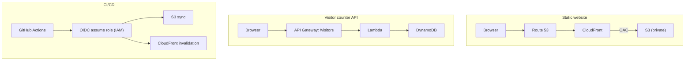

# Cloud Resume Challenge

This is a serverless, cloud-native resume site built on AWS with Infrastructure as Code and CI/CD
This project demonstrates front-end hosting, CDN, API, serverless compute, database, automation, and observability.

## Overview

This project implements a secure, static website architecture on AWS using Terraform. The goal is to demonstrate infrastructure as Code, secure origin design (originally public S3 bucket site endpoint), CDN configuration, DNS management, and cloud troubleshooting practices. 

## What this Project Demonstrates

- IAC (Terraform)
- Secure S3 + CloudFront architecture (Origin Access Control)
- Serverless backend design (API Gateway + Lambda + DynamoDB)
- Least-privilege IAM
- OpenID connect (OIDC) based CI/CD deployment

## Architecture

## Infrastructure Design Decisions

1. Private S3 Bucket + OAC
    - Private S3 Bucket
    - CloudFront accesses objects using signed requests via OAC
    - Enforces HTTPS and caching
2. HTTP API instead fo Rest API
    - Simple configuration
    - Fully compatible with Lambda proxy
    - Ideal for single-route microservice
3. DynamoDB Atomic Counter
    - No race conditions
    - Safe under concurrent traffic
4. OIDC instead of AWS Access Keys
    - No long standing AWS keys
    - GitHub Actions authenticates using AWS IAM OIDC provider
    - Trust policy restricted to:
        - Specific repository
        - Specific branch
    - No static secrets
    - Short lived credentials

## Challenges and Degubbing Experience

1. IAM Permission Errors
    - Encountered
        - `AccessDenied` for DynamoDb
        - Missing `DescribeTable` permission during debugging
        - Missing `s3:ListBucket` for CI/CD
    - Resolution
        - Added precise IAM permissions
        - Verified thorugh CloudWatch Logs
2. CORS mismatch
    - Issue:
        - curl worked
        - Browser showed `fetch-failed`
    - Root Cause
        - API Gateway CORS allowed `http://mitchell-resume.com`
        - Site was servered from `https://mitchell-resume.com`
        - Browser blocked request
    - Fix
        - Updated CORS origin HTTPS origin to `https://mitchell-resume.com`
    - Lesson Learned
        - curl bypasses CORS; browsers enforce it.

## Lessons Learned

- Website endpoint and REST endpoint behave differently
- CloudFront distribution updates and propagation takes time (1 hour in my case)
- DNS changes require propagation patience
